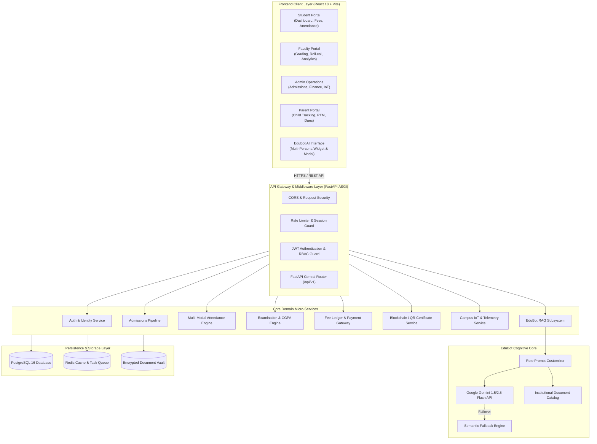
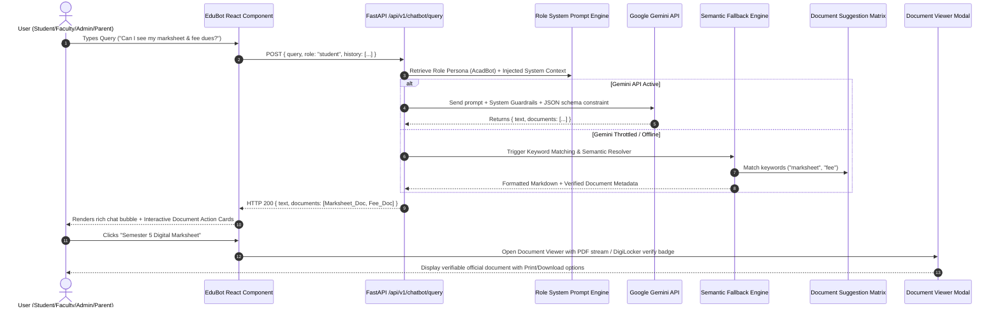
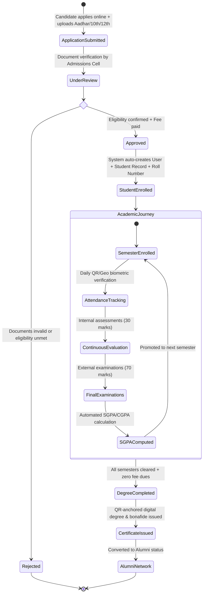
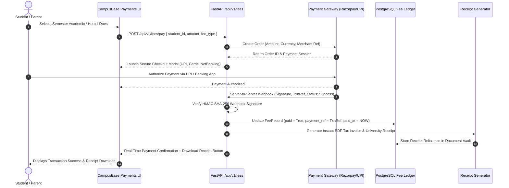
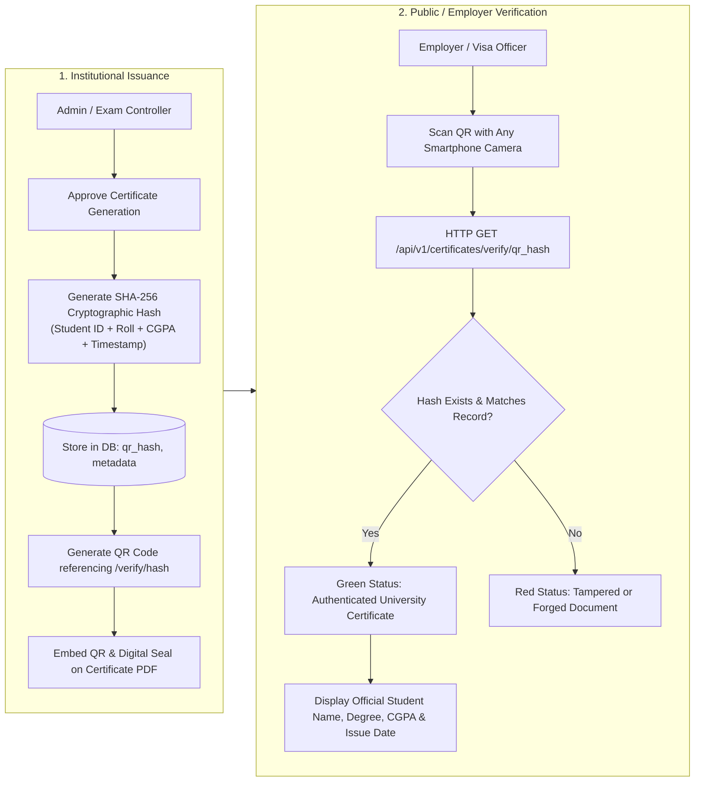
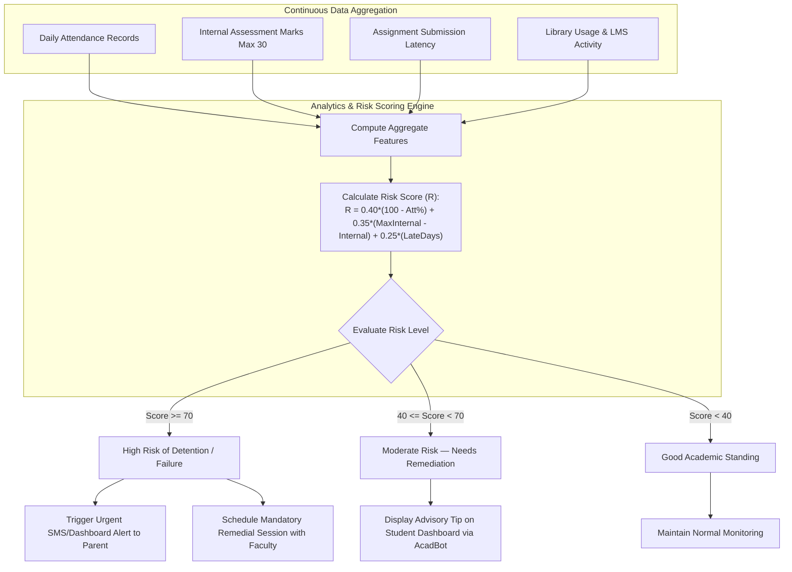
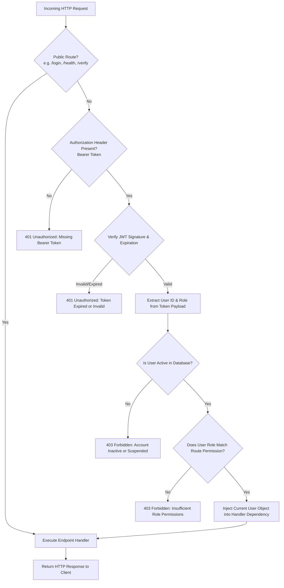

# 🎓 CampusEase: Next-Generation AI-Powered College ERP System
### Idea & Innovation Hackathon 2026 — MPOnline Limited | Technology, Innovation & E-Governance

[](https://react.dev/)
[](https://fastapi.tiangolo.com/)
[](https://www.postgresql.org/)
[](https://ai.google.dev/)
[](https://jwt.io/)
[](LICENSE)

> **CampusEase** is a cloud-native, unified College Enterprise Resource Planning (ERP) platform designed to eliminate fragmentation, manual paperwork, and data opacity in modern higher education institutions. Built on an asynchronous Python **FastAPI** backend and an interactive **React** SPA frontend, CampusEase connects four campus stakeholders (**Students, Faculty, Administrators, and Parents**) into a single, cohesive digital operating system.

---

## 📑 Table of Contents

- [Key Value Propositions](#-key-value-propositions)
- [System Architecture & Technical Flowcharts](#-system-architecture--technical-flowcharts)
  - [1. End-to-End System Architecture](#1-end-to-end-system-architecture)
  - [2. Multi-Persona EduBot RAG Pipeline](#2-multi-persona-edubot-rag-pipeline--document-dispatch)
  - [3. Admission-to-Alumni Student Lifecycle](#3-admission-to-alumni-student-lifecycle)
  - [4. Fee Payment & Ledger Reconciliation](#4-fee-payment--automated-ledger-reconciliation)
  - [5. Blockchain / QR Tamper-Proof Certificates](#5-blockchain--qr-tamper-proof-certificate-verification)
  - [6. Predictive Academic Risk & Early Warning Engine](#6-predictive-academic-risk-analytics--early-warning-engine)
  - [7. Role-Based Access Control (RBAC) & Route Security](#7-role-based-access-control-rbac--route-security-flow)
- [Stakeholder Experience Modules](#-stakeholder-experience-modules)
- [Technology Stack](#-technology-stack)
- [Project Structure](#-project-structure)
- [Quick Start & Installation](#-quick-start--installation)
- [Demo Credentials](#-demo-credentials)
- [REST API Taxonomy](#-rest-api-taxonomy)
- [Documentation Dossier Reference](#-documentation-dossier-reference)

---

## 🌟 Key Value Propositions

- **Unified Multi-Stakeholder Ecosystem:** Tailored role-based interfaces with zero information silos across Student, Faculty, Admin, and Parent portals.
- **Contextual Multi-Persona AI (EduBot):** Role-swapping intelligence featuring *AcadBot* (Student), *FacultyAI* (Faculty), *CampusOps* (Admin), and *GuardianBot* (Parent) delivering actionable answers and live institutional documents directly in chat.
- **Smart Attendance System:** Digital attendance management with faculty-controlled marking, class schedule integration, and automated attendance tracking per subject.
- **Academic Early Warning Engine (EWS):** Regression model correlating attendance metrics, continuous internal marks, and submission latency to flag detention risks before end-semester exams.
- **Tamper-Proof Credentialing:** Digital issuance of Bonafide certificates and grade sheets with cryptographic SHA-256 QR hash verification for instant public/employer validation.
- **Parental Transparency Bridge:** Live visibility into daily attendance, SGPA/CGPA cards, fee payment gateways, and direct Parent-Teacher Meeting (PTM) booking.

---

## 📊 System Architecture & Technical Flowcharts

The following flowcharts detail the complete end-to-end technical mechanics, algorithms, and sequence flows of CampusEase.

### 1. End-to-End System Architecture
A layered view of the client application, API gateway, micro-services, cognitive AI core, and database persistence layers.



---

### 2. Multi-Persona EduBot RAG Pipeline & Document Dispatch
Context-aware query handling with Google Gemini, semantic fallback, role customization, and direct PDF document delivery inside conversation viewport.



---

### 3. Admission-to-Alumni Student Lifecycle
Lifecycle progression from candidate digital application and DigiLocker verification to automated roll-number provisioning, continuous assessment, degree issuance, and alumni transition.



---

### 4. Fee Payment & Automated Ledger Reconciliation
Complete transaction and settlement flow with payment gateway integration, server-side HMAC signature verification, and automated tax invoice generation.



---

### 5. Blockchain / QR Tamper-Proof Certificate Verification
Cryptographic SHA-256 hashing during institutional certificate generation paired with instant public scanning without requiring an authenticated account.



---

### 6. Predictive Academic Risk Analytics & Early Warning Engine
Continuous telemetry aggregation evaluating multi-factor student performance to trigger tiered remediation before detentions occur.



---

### 7. Role-Based Access Control (RBAC) & Route Security Flow
Defense-in-depth authorization filter validating JSON Web Tokens, active database account state, and role claims on every protected API endpoint.



---

## 👥 Stakeholder Experience Modules

| Role | Module Capabilities |
| :--- | :--- |
| **👨‍🎓 Student** | • Real-time Attendance Radar (% & alerts)<br/>• Interactive Timetable & Class Schedule<br/>• Examination Result & SGPA/CGPA Analytics<br/>• Integrated Fee Payment Gateway with PDF receipts<br/>• Verifiable Digital Bonafide Certificate generation<br/>• EduBot (*AcadBot*) with instant document dispatch |
| **👨‍🏫 Faculty** | • Dynamic Rotating QR Code Attendance Generator<br/>• Manual Fallback Roll-Call Grid<br/>• Continuous Internal Evaluation (30-mark ledger)<br/>• Class Risk Matrix with predictive detention flags<br/>• Leave Application & Workload Management<br/>• EduBot (*FacultyAI*) grading assistant |
| **👨‍💼 Administrator** | • Digital Admissions Pipeline & DigiLocker verification<br/>• Institutional Fee Collection & Dues Reconciliation<br/>• Campus IoT Facility Telemetry (Energy, Water, Labs)<br/>• Hostel Room Allocation & Transport Route Tracker<br/>• NAAC/NIRF automated report generators<br/>• EduBot (*CampusOps*) operational analytics |
| **👨‍👩‍👧 Parent** | • Real-time Daily Attendance & Absentee Alerts<br/>• Mid-term & Semester Grade Report Viewer<br/>• Fee Dues Payment Portal (UPI, NetBanking)<br/>• Direct Parent-Teacher Meeting (PTM) slot booking<br/>• EduBot (*GuardianBot*) multilingual performance advisor |

---

## 🛠️ Technology Stack

- **Frontend Application:** React 18, Vite 5, Tailwind CSS, Lucide Icons, Chart.js / Recharts
- **Backend Core:** Python 3.11+, FastAPI (Async ASGI), Pydantic v2
- **ORM & Database:** SQLAlchemy 2.0 (Async + Sync drivers), PostgreSQL 16
- **Cache & Async Queue:** Redis, Celery (optional background worker)
- **AI / LLM Integration:** Google Gemini 1.5/2.5 Flash API + Multi-Persona Prompt Orchestrator + Semantic Keyword Fallback
- **Security & Cryptography:** Passlib (Bcrypt / Argon2), PyJWT (HS256), SHA-256 Document Verification Hashes

---

## 📂 Project Structure

```
campus-ease/
├── backend/                        # FastAPI Python ASGI Backend
│   ├── routers/                    # REST API Route Handlers
│   │   ├── admissions.py           # Online Application Workflow
│   │   ├── auth.py                 # JWT Authentication & Login
│   │   ├── certificates.py         # SHA-256 Tamper-Proof Certificates
│   │   ├── chatbot.py              # EduBot Multi-Persona RAG Engine
│   │   ├── faculty.py              # Faculty Grading & Roll-call
│   │   ├── fees.py                 # Fee Payment & Invoice Generation
│   │   ├── parents.py              # Guardian Portal & Child Tracking
│   │   └── students.py             # Student Records & Attendance
│   ├── config.py                   # Pydantic Settings & Env Config
│   ├── database.py                 # SQLAlchemy Session Engine
│   ├── dependencies.py             # JWT & RBAC Middleware Guards
│   ├── main.py                     # FastAPI Application Factory & CORS
│   ├── models.py                   # Relational PostgreSQL Tables (12+ entities)
│   ├── schemas.py                  # Pydantic Input/Output Schemas
│   ├── seed.py                     # Mock Institution Database Seeder
│   └── requirements.txt            # Python Dependencies
├── src/                            # React 18 SPA Frontend
│   ├── components/                 # Role Portals (Student, Faculty, Admin, Parent)
│   │   ├── Admin/                  # Admissions, Finance, IoT Telemetry
│   │   ├── Faculty/                # QR Attendance Generator, Marks Entry
│   │   ├── Parent/                 # Child Progress, Fee Payment, PTM
│   │   ├── Student/                # Timetable, Grade Cards, Certificates
│   │   └── Shared/                 # EduBot Widget, Document Viewer Modal
│   ├── context/                    # AuthContext & State Management
│   ├── App.jsx                     # Route Configuration
│   └── main.jsx                    # React Virtual DOM Entrypoint
├── public/                         # Static Assets
├── .env.example                    # Frontend Environment Template
├── HACKATHON_PROJECT_MASTER_DOCUMENTATION.md # 8-Document SIH Submission Dossier
├── package.json                    # Node.js Dependencies & Scripts
├── vite.config.js                  # Vite Build Configuration
└── README.md                       # Repository Master Documentation
```

---

## 🚀 Quick Start & Installation

### 1. Prerequisites
- **Node.js** (v18.0 or higher)
- **Python** (v3.10 or higher)
- **PostgreSQL** (v14 or higher)

### 2. Frontend Setup
```bash
# Clone the repository
git clone https://github.com/Ayushmaannn/campus-ease.git
cd campus-ease

# Install Node dependencies
npm install

# Setup environment configuration
cp .env.example .env

# Launch Frontend Vite Server
npm run dev
```
The client portal will be available at `http://localhost:5173`.

### 3. Backend Setup
```bash
# Navigate to backend directory
cd backend

# Create virtual environment
python -m venv venv

# Activate virtual environment
# Windows:
.\venv\Scripts\activate
# Linux/macOS:
source venv/bin/activate

# Install Python dependencies
pip install -r requirements.txt

# Setup environment configuration
cp .env.example .env

# Seed initial institutional database
python seed.py

# Launch FastAPI development server
uvicorn main:app --reload --port 8000
```
Interactive Swagger API documentation will be available at `http://localhost:8000/docs`.

---

## 🔑 Demo Credentials

| Role | Username | Password | Default Portal View |
| :--- | :--- | :--- | :--- |
| **Student** | `student` | `password` | Attendance Radar, Marksheet, Fees, Bonafide |
| **Faculty** | `faculty` | `password` | QR Roll-Call, Internal Marks Ledger, Classes |
| **Admin** | `admin` | `password` | Admissions, Finance Summary, IoT Campus Sensors |
| **Parent** | `parent` | `password` | Ward Attendance, Results, Instant Fee Payment |

---

## 📡 REST API Taxonomy

All endpoints are hosted under prefix `/api/v1`:

- **Authentication:** `POST /api/v1/auth/login`, `POST /api/v1/auth/refresh`, `POST /api/v1/auth/logout`
- **Admissions:** `POST /api/v1/admissions/apply`, `GET /api/v1/admissions/`, `POST /api/v1/admissions/{id}/approve`
- **Students & Faculty:** `GET /api/v1/students/me`, `GET /api/v1/students/`, `GET /api/v1/faculty/me`
- **Smart Attendance:** `POST /api/v1/attendance/mark`, `GET /api/v1/attendance/qr`, `POST /api/v1/attendance/qr/verify`
- **Grades & Marks:** `POST /api/v1/grades/`, `GET /api/v1/grades/student/{id}`, `GET /api/v1/grades/result/{student_id}`
- **Fees & Billing:** `GET /api/v1/fees/student/{id}`, `POST /api/v1/fees/pay`, `GET /api/v1/fees/receipt/{id}`
- **Certificates:** `POST /api/v1/certificates/generate`, `GET /api/v1/certificates/verify/{qr_hash}`
- **EduBot AI Assistant:** `POST /api/v1/chatbot/query` (Accepts `{ query, role, history }`, returns `{ text, documents, source }`)

---

## 📄 Documentation Dossier Reference

For the complete 8-document hackathon submission dossier (Executive Synopsis, 12-Slide Pitch Blueprint, Problem Statement Deep-Dive, Innovation Note, Impact Matrix, Implementation Plan, Tech Architecture, and Prototype Guide), inspect:
👉 [HACKATHON_PROJECT_MASTER_DOCUMENTATION.md](./HACKATHON_PROJECT_MASTER_DOCUMENTATION.md)

---

## 📄 License

This project is licensed under the MIT License — see the [LICENSE](LICENSE) file for details.

Developed with ❤️ for **Idea & Innovation Hackathon 2026** | *Innovate for Madhya Pradesh. Build for Viksit Bharat.*
> Organized by **MPOnline Limited** | 09–10 October 2026 | Bhopal, Madhya Pradesh
